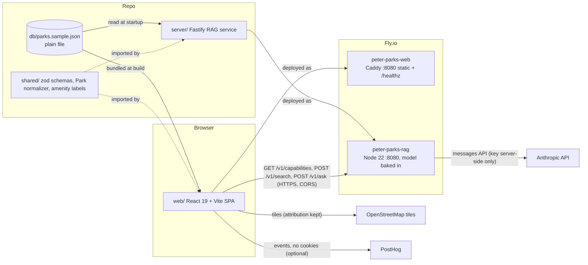

# ARCHITECTURE.md: Parks Finder

Status: **PROPOSED** (architect, for Gate 1). Source of truth for _what_ is `REQUIREMENTS.md`; this file says _how_.
Guiding rule: modest and working beats ambitious (AGENTS rule 13). Every choice below favours the option the human can explain in one sentence.

## 1. The system in plain words

A static React page shows 12 parks from `db/parks.sample.json` on a Leaflet map and in a list; selecting either opens one details dialog. Standard search, amenity filters and sort run entirely in the browser over the same data. A separate, optional Fastify service (`server/`) offers AI search over the same JSON: hybrid retrieval (`/v1/search`, no LLM) and a short grounded answer with verified citations (`/v1/ask`, one Anthropic call). The page asks the service `GET /v1/capabilities`; unless it answers `{ai:true}` no AI control is rendered. Analytics (PostHog) is a no-op unless a key is configured. Both pieces deploy as two Fly.io apps.



## 2. Directory layout and ownership

One npm package at the root. Paths are exact; the ticket that owns each is in brackets. T1 creates every shared file; later tickets only edit files they own.

```
package.json, package-lock.json            [T1] all deps, all scripts (frozen after T1)
tsconfig.json                               [T1] single config: web + server + shared + scripts + e2e
eslint.config.js, .prettierrc.json, .prettierignore, .lintstagedrc.json   [T1]
jest.config.cjs, playwright.config.ts       [T1]
.husky/pre-commit, .husky/pre-push          [T1]
.github/workflows/ci.yml                    [T1]
.github/pull_request_template.md            [T1]
.claude/agents/*.md                         [T1] one per AGENTS.md role
scripts/validate-data.ts                    [T1]
db/parks.sample.json                        never edited
shared/
  parks.ts          [T1] RawPark (lenient zod), Park type, normalizePark(), loadParks()
  amenities.ts      [T1] AMENITY_LABELS map + amenityLabel(slug)
  api.ts            [T1] service contract (section 9)
  *.test.ts         [T1]
web/
  index.html        [T1] lang="en", <title>Find a Park: NYC-area parks</title>
  vite.config.ts    [T1] root web/, envDir repo root, server.fs.allow ['..']
  test/setup.ts, test/envStub.ts, test/fileStub.cjs, test/fixtures.ts   [T1]
  src/main.tsx      [T1] render <App/>, then initAnalytics() after first paint
  src/env.ts        [T1] the ONLY reader of import.meta.env
  src/App.tsx       [T1] shell: provider, landmarks, slots, live region
  src/styles.css    [T1] tokens, focus ring, .visually-hidden, layout grid, reduced motion
  src/data/parks.ts [T1] loadParks(raw JSON) -> Park[] (module constant)
  src/state/        [T1] types.ts, reducer.ts, AppState.tsx (context + hooks), selectors.ts, *.test.ts
  src/a11y/         [T1] LiveRegion.tsx, useAnnounce.ts, SkipLink.tsx, focus.ts
  src/analytics.ts  [T1 typed no-op; T8 implements PostHog]
  src/search/       [T4] filterParks.ts (T1 ships a pass-through stub), sortParks.ts, *.test.ts
  src/ai/           [T7] client.ts, useCapabilities.ts, *.test.ts
  src/components/
    ParkList/       [T2] ParkList.tsx (directory section + toggle + list), ParkList.test.tsx
    ParkDetails/    [T2] ParkDetails.tsx (dialog), ParkImage.tsx, *.test.tsx
    ParkMap/        [T3] ParkMap.tsx, markerIcons.ts, ParkMap.test.tsx
    SearchBar/      [T4] SearchBar.tsx, AmenityFilter.tsx, SortSelect.tsx, ResetButton.tsx, *.test.tsx
    AiPanel/        [T7] AiPanel.tsx, ModeSwitch.tsx, AiAnswer.tsx, *.test.tsx
server/
  tsup.config.ts    [T1]
  src/index.ts      [T1] load config, build app, listen (thin entry)
  src/config.ts     [T1] env loading (section 11)
  src/app.ts        [T1] buildApp(deps): cors, rate limit, error handler, registers all routes
  src/types.ts      [T1] Retriever, LlmClient, Chunk interfaces
  src/routes/health.ts, capabilities.ts      [T1] (capabilities is 5 lines; T1 finishes it)
  src/routes/search.ts                       [T5] (T1 stub answers 503 ai_unavailable)
  src/routes/ask.ts                          [T6] (T1 stub answers 503 ai_unavailable)
  src/rag/          [T5] chunk.ts, lexical.ts, embedder.ts, retrieve.ts, index.ts (createDefaultRetriever; T1 stub)
  src/rag/generate.ts, src/rag/verifyCitations.ts, src/dailyCap.ts   [T6]
  src/llm/          [T6] anthropic.ts, index.ts (createDefaultLlm; T1 stub returns null)
  scripts/build-index.ts, scripts/eval-retrieval.ts, evals/queries.json   [T5]
  scripts/eval-ask.ts                        [T6]
  test/*.test.ts    [per ticket: health/capabilities T1, search/retrieval T5, ask/verify/cap T6]
e2e/
  fixtures.ts       [T1] tile stubbing, helpers;  smoke.spec.ts [T1]
  list-details.spec.ts [T2] · map.spec.ts [T3] · search.spec.ts [T4] · ai.spec.ts [T7]
  a11y.spec.ts, tab-order.spec.ts, aria-snapshots.spec.ts (+ snapshots) [T9]
deploy/
  web.Dockerfile, Caddyfile, fly.web.toml, server.Dockerfile, fly.rag.toml   [T10]
.dockerignore, .github/workflows/deploy-web.yml, deploy-rag.yml             [T10]
docs/VERIFICATION.md (WCAG table + VoiceOver script)                         [T9]
```

## 3. Shared state (`web/src/state/`, created by T1, frozen afterwards)

React `useReducer` + one context. No state library. Data (`parks`) is a module constant, not state.

```ts
// state/types.ts
export type SearchMode = 'filters' | 'ai' | 'both';
export type SortKey = 'name' | 'rating' | 'acreage' | 'distance' | 'relevance';
export type SelectSource = 'list' | 'map' | 'search_result' | 'ai_citation';
export type AiStatus = 'idle' | 'loading' | 'ready' | 'error';

export interface AppState {
  selectedParkId: string | null;
  selectSource: SelectSource | null;
  returnFocusId: string | null; // DOM id of the trigger; details focuses it on close
  query: string; // standard text search
  amenities: string[]; // selected slugs (AND)
  sort: SortKey; // default 'name'
  origin: { lat: number; lng: number } | null; // "near me"; never leaves the browser
  directoryOpen: boolean; // initial: matchMedia('(min-width: 768px)')
  aiAvailable: boolean; // set only by T7's useCapabilities
  mode: SearchMode; // default 'both'; effective mode is 'filters' unless aiAvailable
  ai: {
    status: AiStatus;
    query: string;
    resultIds: string[] | null; // ranked parkIds from /v1/search; null = no AI search yet
    matches: Record<string, string>; // parkId -> matchedText
    answer: AskResponse | null; // from shared/api.ts
    errorCode: ErrorCode | null;
  };
}

export type Action =
  | { type: 'selectPark'; id: string; source: SelectSource; returnFocusId: string }
  | { type: 'closeDetails' }
  | { type: 'setQuery'; query: string }
  | { type: 'toggleAmenity'; slug: string }
  | { type: 'setSort'; sort: SortKey }
  | { type: 'setOrigin'; origin: { lat: number; lng: number } | null }
  | { type: 'setDirectoryOpen'; open: boolean }
  | { type: 'capabilitiesResolved'; ai: boolean }
  | { type: 'setMode'; mode: SearchMode }
  | { type: 'aiSearchStarted'; query: string }
  | { type: 'aiSearchSucceeded'; results: SearchResult[] } // sets sort 'relevance'
  | { type: 'aiAnswerReceived'; answer: AskResponse }
  | { type: 'aiFailed'; code: ErrorCode }
  | { type: 'reset' }; // clears query, amenities, sort->'name', selection, origin, ai.*; keeps mode and directoryOpen
```

Hooks exported from `AppState.tsx`: `useAppState()`, `useDispatch()`, `useVisibleParks()`.
`selectors.ts` (T1, complete, unit-tested with the stubbed filter):

```ts
effectiveMode(s) = s.aiAvailable ? s.mode : 'filters'
visibleParks(parks, s):
  ai = s.ai.resultIds ? parks in AI rank order restricted to resultIds : null
  'filters' -> sortParks(filterParks(parks, s), s)
  'ai'      -> ai ?? parks (sorted by name)                       // standard filters not rendered, not applied
  'both'    -> sortParks(filterParks(ai ?? parks, s), s)          // 'relevance' keeps AI order
```

Rules: setting `mode` to `'filters'` clears `sort:'relevance'` back to `'name'`. Leaving `'relevance'` available only while `ai.resultIds` is non-null.

## 4. Component tree and landmarks

```
<App>  StateProvider
  <a class="skip-link" href="#directory-heading">Skip to results</a>            (T1)
  <header>  banner
    <h1>Find a Park</h1> <p>NYC-area parks</p>
    <AiPanel/>      returns null unless aiAvailable  (T7)  role="search" aria-label="AI search"
    <SearchBar/>    hidden (not rendered) when effectiveMode==='ai' (T4)  role="search" aria-label="Search and filter parks"
  <main>
    <ParkList/>     <section aria-labelledby="directory-heading">  (T2)
    <a class="skip-link" href="#after-map">Skip map</a>                          (T1)
    <ParkMap/>      <section aria-labelledby="map-heading"> h2 visually hidden "Map of parks" (T3)
    <span id="after-map" tabIndex={-1}/>
  <footer>  contentinfo: data note, map attribution note, analytics disclosure (T1; T8 edits wording via analytics.ts constant)
  <ParkDetails/>    <dialog> rendered at root, only when selectedParkId (T2)
  <LiveRegion/>     one polite status region (T1)
```

Heading outline: `h1` Find a Park · `h2` Park directory · `h2` Map of parks (visually hidden) · `h2` AI answer (inside AiPanel, when present) · details dialog: `h2` park name, `h3` Amenities, Address, Hours, Size and rating, Contact.

Layout (CSS grid in `styles.css`, T1): desktop >= 768px: header full width; directory column 22rem left, map fills the rest (min-height 60vh). Phone: single column, header, directory collapsed by default (toggle button), map 60vh. Reflow at 320px: the map is the only 2-D scroll area (allowed by 1.4.10).

## 5. Details presentation (decision: native modal `<dialog>`)

Recommendation: one `<dialog>` opened with `showModal()`, styled as a right-side sheet (max-width 28rem, full height) on desktop and full-screen on phone. A modal is justified here because the browser gives us, for free and identically on every viewport: Esc to close, background `inert` (so nothing behind it can take focus, which removes the 2.4.11 "focus obscured" risk on phone), top-layer stacking above Leaflet's z-indexes, and the "dialog, <name>" announcement in VoiceOver. A non-modal side panel would need a hand-built inert/focus policy that differs between phone and desktop: more code to defend. Cost: the map isn't clickable while details are open (close, then pick another). Acceptable for this task.

- `aria-labelledby` = the `h2` park name. On open: `showModal()`, then focus the `h2` (`tabIndex={-1}`), so VoiceOver reads the park name first. Close button (top-right, visible text "Close", 44px) is the first Tab stop inside.
- Close via button, Esc (`cancel` event), or backdrop click: dispatch `closeDetails`, then focus `document.getElementById(returnFocusId)`; fallbacks: `park-list-item-<id>` button, then `#directory-heading` (tabIndex -1). Helper `focusById` lives in `a11y/focus.ts` (T1).
- Trigger ids: list button `park-list-item-<id>`; marker icon element `park-marker-<id>`; AI citation `ai-citation-<n>`.
- Content (render only what exists; section 3 of REQUIREMENTS): image (first image only), description `p`, amenities `ul` of labels, Address, Hours (verbatim), Size and rating ("526 acres", "Rated 4.7 out of 5"; text, no stars-only), Contact: "Contact information not listed" always (no field in data). Missing field: the section shows "Not listed" (heading kept so the outline is stable). `description` missing: omit the paragraph.
- jsdom lacks `showModal`: `web/test/setup.ts` polyfills `HTMLDialogElement.prototype.showModal/close` (sets `open`). Real behavior is covered by Playwright.

## 6. Map keyboard accessibility and tab-stop budget

- react-leaflet `MapContainer` with OSM tiles and attribution kept. Map container gets `aria-label="Map of parks. Use arrow keys to pan."` (Leaflet already makes it focusable for arrow panning).
- Markers: the default `L.Icon.Default` with icon URLs fixed explicitly (import the PNGs from `leaflet/dist/images`, `mergeOptions`; Jest maps `.png` to `fileStub`). `keyboard: true`, `alt`/`title` = park name. In the marker `add` event the icon element gets `id="park-marker-<id>"`, `role="button"` (assert; set if Leaflet didn't), `aria-label` = park name, and a `keydown` handler: Space (and Enter, defensively) -> `preventDefault()` + select. Click and Enter/Space all dispatch `selectPark(source:'map')`.
- Only parks with valid `coords` get markers; the list shows "Not shown on map" for others. Markers follow `visibleParks` (filtered parks disappear from both list and map). Selected marker: `zIndexOffset` + CSS class with a non-color cue (larger, outlined); not relied on for meaning.
- Tab-stop budget (desktop, no AI, nothing expanded): Skip to results, Search parks, Amenities (summary), Sort, Reset, Directory toggle, 12 list buttons, Skip map, map container, 12 markers, Zoom in, Zoom out, attribution links (Leaflet, OpenStreetMap), footer links. Markers stay in the tab order (they are the map's whole point for keyboard users); "Skip map" lets anyone jump the ~16 map stops, and the list is the full alternative. On select the map pans to the marker (`setView`, `animate` false under reduced motion). No auto-focus moves on the map ever.

## 7. Live-region plan (`a11y/LiveRegion.tsx`, `useAnnounce()`)

One visually hidden `<div role="status" aria-live="polite" aria-atomic="true">`. `announce(text)` clears then sets after 50 ms so repeated identical messages are re-read. Owners call it; nothing else uses `aria-live`.

| Event                                       | Message                                                                                     | When                              | Owner |
| ------------------------------------------- | ------------------------------------------------------------------------------------------- | --------------------------------- | ----- |
| Result count after query/filter/sort change | "5 parks shown" / "No parks match. Try removing a filter."                                  | 500 ms debounce after last change | T4    |
| Reset                                       | "Search and filters cleared. 12 parks shown."                                               | on click                          | T4    |
| Directory toggled                           | none (aria-expanded conveys it)                                                             |                                   |       |
| Details open/close                          | none (focus moves; heading read)                                                            |                                   |       |
| AI became available                         | "AI search is available."                                                                   | once, on false->true              | T7    |
| Mode change                                 | "Mode: AI search only" / "Filters only" / "AI and filters"                                  | on change                         | T7    |
| AI search done                              | "AI found 4 parks"                                                                          | on result                         | T7    |
| Answer ready                                | "Answer ready." (the answer text itself is NOT in the live region)                          | on result                         | T7    |
| Errors                                      | "AI search is unavailable right now. Standard search still works." / rate-limit / cap texts | on failure                        | T7    |
| Location                                    | "Sorted by distance from you" / "Location not available"                                    |                                   | T4    |

## 8. Reduced motion and polish

No animations are required. Any transition is declared only inside `@media (prefers-reduced-motion: no-preference)`. Leaflet gets `zoomAnimation`, `fadeAnimation`, `markerZoomAnimation` = `!reduced` and `setView(..., {animate: !reduced})`; no `flyTo`. Polish is the first cut.

## 9. Service contract (`shared/api.ts`, zod 4)

```ts
CapabilitiesResponse = z.object({ ai: z.boolean() });
SearchRequest = z.object({
  query: z.string().trim().min(1).max(200),
  limit: z.number().int().min(1).max(12).optional(),
});
SearchResult = z.object({
  parkId: z.string(),
  score: z.number(),
  field: ChunkField,
  matchedText: z.string(),
});
SearchResponse = z.object({ mode: z.enum(['hybrid', 'lexical']), results: z.array(SearchResult) }); // [] = abstained
AskRequest = z.object({ query: z.string().trim().min(1).max(200) });
Citation = z.object({ parkId: z.string(), chunkId: z.string(), quote: z.string() });
AskResponse = z.object({
  answer: z.string(),
  citations: z.array(Citation),
  abstained: z.boolean(),
  mode: z.enum(['hybrid', 'lexical']),
  latencyMs: z.number(),
  usage: z.object({ inputTokens: z.number(), outputTokens: z.number() }).optional(),
});
ErrorCode = z.enum([
  'bad_request',
  'rate_limited',
  'daily_cap_reached',
  'ai_unavailable',
  'timeout',
  'internal',
]);
ErrorBody = z.object({ error: z.object({ code: ErrorCode, message: z.string() }) });
ChunkField = z.enum(['overview', 'amenities', 'address', 'hours', 'size']);
```

Status codes: 200; 400 `bad_request` (zod failure, too long); 429 `rate_limited` + `Retry-After`; 429 `daily_cap_reached` + `Retry-After` (seconds to UTC midnight); 503 `ai_unavailable` (no key, or Anthropic failed); 504 `timeout`; 500 `internal`. `GET /healthz` -> `200 {"ok":true}`.

**No SSE (deviation from FR-21, flagged).** `/v1/ask` returns one JSON body. Reasons: the server must verify every citation against the whole answer before the user sees it (streaming unverified tokens then retracting them is worse); answers are short (`max_tokens` 400, ~2-4 s); a single response cannot chatter at a screen reader; client and tests are simpler. The UI shows "Searching..." meanwhile. If the human wants SSE, it is an isolated change in `routes/ask.ts` and `ai/client.ts`.

## 10. Capability model and fallback matrix

`useCapabilities` (T7): if `env.ragUrl` is empty, do nothing (`aiAvailable` stays false; no request). Otherwise `GET {ragUrl}/v1/capabilities` with a 4 s `AbortController` timeout; on network error/5xx retry at 2, 4, 8, 16, 30 s (5 tries), then stop. Dispatch `capabilitiesResolved` only on a valid zod-parsed answer. AI controls mount in their header slot. To avoid a layout jump, the header reserves the AiPanel's minimum height only while a capabilities request is in flight (an empty, `aria-hidden` spacer; no controls), and removes it if the answer is `ai:false` or the retries give up. Focus never moves when AI appears.

| Situation                                             | Capabilities          | Standard UI | AI UI                                                       | Message                                                            |
| ----------------------------------------------------- | --------------------- | ----------- | ----------------------------------------------------------- | ------------------------------------------------------------------ |
| No `VITE_RAG_URL` (zip default)                       | not requested         | full        | absent from DOM                                             | none                                                               |
| Server up, no key                                     | `{ai:false}`          | full        | absent                                                      | none                                                               |
| Service cold (Fly machine starting)                   | slow / retried        | immediately | appears when resolved                                       | "AI search is available."                                          |
| Service down / unreachable                            | retries then gives up | full        | absent                                                      | none                                                               |
| AI on, `/v1/search` or `/v1/ask` 503 or network error | already true          | full        | stays; list falls back to standard results                  | "AI search is unavailable right now. Standard search still works." |
| Rate limited (429)                                    | true                  | full        | stays                                                       | "Too many AI searches. Try again in N seconds."                    |
| Daily cap hit                                         | true                  | full        | stays; `/v1/search` still works (cap counts `/v1/ask` only) | "Today's AI answer limit is reached. Search results still shown."  |
| Embedding model fails to load                         | true                  | full        | stays                                                       | none; responses report `mode: lexical`                             |

## 11. Environment (Gate 0: `.env.local`, not `.env`)

- One root `.env.local` (gitignored by `.env.*`). Vite `envDir` = repo root, so Vite reads `.env.local` natively and exposes only `VITE_*`.
- `web/src/env.ts` exports `{ ragUrl, posthogKey, posthogHost, captureQueryText }` (strings default `''`). Jest maps `^.+/env$` to `web/test/envStub.ts` (tests override fields per test). Only this one module may be named `env`.
- `server/src/config.ts`: `try { process.loadEnvFile('.env.local') } catch {}` (Node >= 22 built-in; never overrides real env vars, so Fly secrets win), then reads `PORT` (8787 dev, 8080 Fly), `ANTHROPIC_API_KEY`, `ANTHROPIC_MODEL` (cheap default; rag-engineer confirms the current model id against Anthropic docs, does not guess), `CORS_ORIGIN` (default `http://localhost:5173`), `AI_DAILY_REQUEST_CAP` (unset = no cap), `RATE_LIMIT_PER_MINUTE` (default 20), `MODEL_CACHE_DIR` (default `server/.cache/models`, ignored by `.cache/`). Logs never print values.

## 12. Standard search, filters, sort (T4, `web/src/search/`)

- **Text search** (one input, live as you type, label "Search parks"): trim, lowercase, split on whitespace; a park matches when every word appears in name, description, address, or amenity labels. Missing fields simply don't match. The wireframe's separate "park filter input" in the directory is merged into this one input (one search box, flagged below).
- **Amenities**: `<details><summary>Amenities (2 selected)</summary>` containing a `<fieldset><legend>` of checkboxes, labels from `shared/amenities.ts`, alphabetical. **AND semantics**: a park must have every checked amenity. Residents filter for needs ("dog run and restrooms"); AND narrows predictably and the count announcement explains empty results. OR would show parks lacking what they asked for.
- **Sort** (`<select>` label "Sort by"): Name A-Z (default), Rating high-low, Size large-small, Distance (option appears after "Use my location" succeeds), Best match (only while AI results exist). Missing values always sort last, ties by name.
- **Near me (FR-10, could)**: button "Use my location"; `getCurrentPosition` only on click; denial -> announce, no crash; haversine in the browser; coordinates never sent anywhere. First thing cut in T4.
- **Reset** button: dispatch `reset`; focus stays on the button.

## 13. Amenity labels (`shared/amenities.ts`)

Explicit map for all 26 slugs in the data: `accessible-paths` Accessible paths · `basketball` Basketball · `bike-path` Bike path · `boardwalk` Boardwalk · `cafe` Cafe · `dog-run` Dog run · `event-lawn` Event lawn · `fishing` Fishing · `food-vendors` Food vendors · `gardens` Gardens · `gift-shop` Gift shop · `kayak-launch` Kayak launch · `lake` Lake · `lighting` Lighting · `parking` Parking · `picnic-areas` Picnic areas · `playground` Playground · `restrooms` Restrooms · `skate-park` Skate park · `splash-pad` Splash pad · `sports-fields` Sports fields · `trails` Trails · `water-fountain` Water fountain · `waterfront` Waterfront · `wifi` Wi-Fi · `wildlife-viewing` Wildlife viewing. Labels add no words the slug doesn't state. Unknown slug: replace `-` with space, capitalise the first letter; never dropped.

## 14. Data loading and missing data (`shared/parks.ts`)

`RawPark` is lenient (every field optional/nullable). `normalizePark(raw)` returns `Park | null`:
`{ id, name, description?, address?, coords?: {lat,lng}, amenities: string[], hours?, images: string[], acreage?, rating? }`.
Strings trimmed, empty -> `undefined`; arrays default `[]` with empty strings removed; numbers kept only if finite (rating also 0-5, acreage > 0); coords only if lat in [-90,90] and lng in [-180,180]. Missing `id`/`name` -> `null` + warning (skipped, `console.warn` in the web loader). No defaults are ever invented. Web imports the JSON directly (`import raw from '../../../db/parks.sample.json'`); the server reads it with `fs` at startup. `npm run validate:data` prints the warnings and exits 1 only if the file isn't an array. Dataset is used verbatim (README "Dataset changes: none").

**Images** (`ParkImage`, T2): fixed 16:9 box so failure causes no layout jump. ``; `onError` swaps to `<div role="img" aria-label="Photo of {name} unavailable">` with visible text "Image unavailable" and an `aria-hidden` icon. No images: "Photos not listed". Only the first image is shown (gallery not built). All sample URLs fail, so the placeholder is the normal path and is what the e2e asserts.

## 15. RAG design (`server/`)

- **Chunks** (`rag/chunk.ts`): per park per field group, `chunkId = "<parkId>#<field>"`, text prefixed with the park name: `overview` (name + description), `amenities` (labels), `address`, `hours`, `size` ("526 acres. Rated 4.7 out of 5."). Missing field -> no chunk. About 55 chunks total.
- **Lexical** (`rag/lexical.ts`): BM25 (k1 1.2, b 0.75), lowercase word tokens, a short stopword list. ~60 lines, no dependency.
- **Dense** (`rag/embedder.ts`): `@huggingface/transformers` feature-extraction with `Xenova/all-MiniLM-L6-v2` (mean pooling, normalised), cache in `MODEL_CACHE_DIR`. Loaded in the background after `listen`; until ready (or if it fails) retrieval is lexical and responses say `mode: 'lexical'`. The index (55 vectors) is computed in memory at startup; `build:index` downloads the model and prints chunk stats, and the Dockerfile runs it so the model is baked into the image.
- **Fusion** (`rag/retrieve.ts`): reciprocal rank fusion, k = 60, over the two ranked chunk lists; park score = best chunk; result carries that chunk's field and text.
- **Abstention** (before any LLM call): abstain when the query has no BM25 term overlap with any chunk AND (lexical mode OR best cosine < **0.30**). RRF scores are rank-based, so thresholds use the raw signals. T5 set 0.30 (started at 0.35) from the threshold sweep that `npm run eval:retrieval` prints: 0.25 and 0.30 tie at 21/23 correct abstention decisions, while 0.35 dropped hybrid recall@3 from 0.96 to 0.78. Data is never tuned.
- **Known limitation (abstention):** one shared word is enough to skip abstention (e.g. "stock market forecast" matches "weekend markets"), and dense similarity can clear the threshold for off-topic queries near a real fact ("best pizza delivery nearby" scores 0.42 against food vendors). `/v1/search` then returns loosely related parks. For answers this is mitigated by T6: the model is told to abstain when the chunks don't answer the question, and server-side citation verification abstains when no valid citation remains.
- **Generation** (`rag/generate.ts`, `llm/anthropic.ts`): top 6 chunks, each wrapped `<chunk id="...">...</chunk>`; the user query in `<question>` and described as untrusted; system prompt: answer only from chunks, no outside knowledge about real places, reply as JSON `{"answer": string, "citations": [{"chunkId": string, "quote": string}]}` or `{"abstain": true}`. No tools, `temperature 0`, `max_tokens 400`, 15 s timeout.
- **Verification** (`rag/verifyCitations.ts`): parse JSON (failure -> abstain); keep a citation only if `chunkId` was retrieved and `quote` is a whitespace/case-normalised substring of that chunk, at least 6 characters (so amenity labels like "Dog run" count) and containing a word beyond the park name; `parkId` derived server-side from `chunkId`; none left -> abstain with "I don't have that information in the park data."
- **Guards** (`app.ts`): `@fastify/cors` origin = `CORS_ORIGIN`; `@fastify/rate-limit` per IP; body limit 2 KB; zod-validated bodies; `dailyCap.ts` in-memory counter reset at UTC midnight (per machine; documented limitation). The cap counts model calls only (an ask that abstains at retrieval is free); it is per machine and also resets when the process restarts. Logs: request id, route, latency, tokens, retrieved chunk ids; never headers or keys.
- **Testability**: `buildApp({ config, retriever, llm })`; tests pass fakes, so no `jest.mock` of ESM-only packages is needed. `embedder.ts` and `llm/anthropic.ts` are thin adapters around the real libraries.
- **Evals**: `evals/queries.json` ~20 queries (keyword, paraphrase with no keyword overlap, negative/off-topic, "ignore previous instructions"). `eval:retrieval` prints recall@3 and MRR for lexical / dense / hybrid and runs in CI (lexical-only with a warning if the model can't download). `eval:ask` (manual, real key) reports citation validity, abstention accuracy, unsupported-fact count.

## 16. Analytics wrapper (`web/src/analytics.ts`)

```ts
export type AnalyticsEvent =
  | { name: 'park_selected'; props: { park_id: string; source: SelectSource } }
  | { name: 'details_closed'; props: { park_id: string; method: 'button' | 'escape' | 'backdrop' } }
  | { name: 'directory_toggled'; props: { open: boolean } }
  | {
      name: 'search_submitted';
      props: {
        mode: SearchMode;
        query_length: number;
        result_count: number;
        latency_ms: number;
        fallback_used: boolean;
      };
    }
  | { name: 'search_result_clicked'; props: { park_id: string; rank: number } }
  | {
      name: 'ai_answer_shown';
      props: { abstained: boolean; citation_count: number; latency_ms: number };
    }
  | { name: 'ai_answer_feedback'; props: { helpful: boolean } }
  | { name: 'ai_unavailable'; props: { reason: ErrorCode | 'unreachable' } }
  | { name: 'filter_applied'; props: { filter: 'amenity' | 'sort' | 'text'; value: string } } // value = slug or sort key, never free text
  | { name: 'search_mode_changed'; props: { mode: SearchMode } }
  | { name: 'reset_clicked'; props: Record<string, never> }
  | { name: 'location_requested'; props: { granted: boolean } };
export function initAnalytics(): void; // no-op without env.posthogKey; called after first render
export function track(e: AnalyticsEvent): void; // never throws (try/catch), no-op until init succeeded
export const ANALYTICS_DISCLOSURE: string; // footer text
```

T1 ships the types and a no-op body so T2-T7 can call `track` from day one. T8 adds `posthog-js` with: memory persistence, `person_profiles: 'identified_only'` (never identify), Do Not Track respected, session recording disabled, autocapture limited to clicks on `button`/`a`, one pageview per load. T8 checks each option name against the current posthog-js docs (FR-31: don't guess). `posthog-js` is lazy-imported inside `initAnalytics` so it stays out of the critical path and out of Jest unless T8 tests it with a mock.

## 17. Test strategy

- **Jest 30** (`jest.config.cjs`, `@swc/jest`, two projects): `web` (jsdom; `web/**/*.test.tsx?`; setup = jest-dom, jest-axe `toHaveNoViolations`, dialog polyfill, `matchMedia` mock) and `node` (`shared/**`, `server/**`, `scripts/**`). Mappers: `\.css$` -> identity stub, `\.(png|svg)$` -> `web/test/fileStub.cjs`, `^.+/env$` -> `web/test/envStub.ts`. Test files live beside code (`*.test.ts(x)`), so each ticket's tests are inside its own folder.
- **What each UI ticket must test**: behavior via user-event (keyboard: Tab, Enter, Space, Esc), a full fixture park and the synthetic all-optional-missing park (`web/test/fixtures.ts`), and `expect(await axe(container)).toHaveNoViolations()` for each state. Leaflet runs in jsdom for marker rendering and key handlers; real focus/order is Playwright's job.
- **Coverage thresholds** (global): statements 80, lines 80, functions 75, branches 70. **Proposed exclusions** (human approves at G1): `web/src/main.tsx`, `web/src/env.ts`, `server/src/index.ts`, `server/src/rag/embedder.ts`, `server/src/llm/anthropic.ts` (thin adapters over network/model; covered by `eval:*` and e2e), `server/scripts/**`, `scripts/**`, `e2e/**`, `**/*.config.*`, `**/test/**`, `*.d.ts`.
- **Playwright** (`playwright.config.ts`): projects `desktop` (Chromium 1280x800) and `phone` (Pixel 7 profile). `webServer` builds the web app with `VITE_RAG_URL=http://127.0.0.1:9` (nothing listening) and serves `vite preview`, so the default run IS the "service unreachable" case; AI specs use `page.route` to fake `/v1/*` (`ai:true`, errors, 429). `e2e/fixtures.ts` routes OSM tiles to a local 1x1 PNG (no tile traffic; tile-failure spec aborts them). Geolocation denied by default.
- **T9 owns**: `a11y.spec.ts` (axe on every state x both projects: default, details open, filters active, no results, image failed, sparse park, AI mode, errors), `tab-order.spec.ts` (Tab repeatedly, compare focused accessible names to section 6's list), `aria-snapshots.spec.ts` (`toMatchAriaSnapshot` for banner, directory, details dialog), plus the WCAG 2.2 table and VoiceOver script in `docs/VERIFICATION.md`.
- **CI** (`ci.yml`, on PR and push to main): `npm ci`; grep for `\.(only|skip|todo)\(` in tests (fail); `format:check`; `lint`; `typecheck`; `test:coverage`; `build`; `eval:retrieval` (model cache restored via `actions/cache` on `server/.cache/models`); `npx playwright install --with-deps chromium`; `e2e`.
- **Hooks**: `pre-commit` = `npx lint-staged && npm run typecheck`; `pre-push` = `npm test`. lint-staged globs: `*.{ts,tsx,js,cjs}` (eslint --fix, prettier --write) and `*.{json,md,css,yml}` (prettier --write), both excluding `db/**` and `transcripts/**`.

## 18. Tooling and pinned versions (confirmed with `npm view` on 2026-10-02)

| Package                                                                                         | Pin                                  | Note                                                   |
| ----------------------------------------------------------------------------------------------- | ------------------------------------ | ------------------------------------------------------ |
| react, react-dom                                                                                | ^19.3.0                              |                                                        |
| vite / @vitejs/plugin-react                                                                     | ^8.3.2 / ^6.1.1                      | plugin-react 6 requires vite 8                         |
| leaflet / react-leaflet / @types/leaflet                                                        | ^1.9.4 / ^5.0.0 / ^1.9.22            | react-leaflet 5 peers react 19                         |
| fastify / @fastify/cors / @fastify/rate-limit                                                   | ^5.12.5 / ^11.3.0 / ^11.2.0          |                                                        |
| zod                                                                                             | ^4.6.5                               |                                                        |
| @anthropic-ai/sdk                                                                               | ^0.131.0                             |                                                        |
| @huggingface/transformers                                                                       | ^4.3.0                               | postinstall needs network; never `--ignore-scripts`    |
| jest / jest-environment-jsdom / @swc/jest                                                       | ^30.5.2 / ^30.5.2 / ^0.2.39          | `jest.config.cjs` (package is `"type":"module"`)       |
| @testing-library/react / jest-dom / user-event / jest-axe                                       | ^16.3.3 / ^7.0.1 / ^14.6.7 / ^11.0.0 | + @types/jest ^30, @types/jest-axe ^3.5.9              |
| @playwright/test / @axe-core/playwright                                                         | ^1.63.0 / ^4.13.0                    |                                                        |
| posthog-js                                                                                      | ^1.435.7                             |                                                        |
| husky / lint-staged                                                                             | ^9.1.7 / ^17.6.0                     |                                                        |
| eslint / @eslint/js                                                                             | **^9.39.5** (not 10)                 | jsx-a11y peers eslint <= 9                             |
| typescript                                                                                      | **~6.0.3** (not 7)                   | typescript-eslint 8.71 peers `<6.1.0`                  |
| typescript-eslint / eslint-plugin-jsx-a11y / eslint-plugin-react-hooks / eslint-config-prettier | ^8.71.0 / ^6.10.2 / ^7.1.1 / ^10.1.8 |                                                        |
| prettier / tsup / tsx                                                                           | ^3.9.9 / ^8.5.1 / ^4.23.15           |                                                        |
| concurrently                                                                                    | ^10.0.5                              | **addition** for `npm run dev` (web + server together) |

Node 22.22 locally (`engines: ">=22.12"`, Vite 8's floor). Other gotchas T1 must respect: exclude `.worktrees/**` from ESLint, Prettier, Jest, tsconfig, Vite; `.prettierignore` includes `transcripts/`, `db/`, `package-lock.json`, `dist/`, `coverage/`, `.worktrees/`; jsx-a11y rules as errors and `--max-warnings=0`; `npx husky` in each new worktree (orchestrator).

Scripts: `dev` (concurrently dev:web dev:server) · `dev:web` (`vite --config web/vite.config.ts`) · `dev:server` (`tsx watch server/src/index.ts`) · `build` (build:web + build:server via tsup to `server/dist`) · `check` (format:check, lint, typecheck, test:coverage, build) · `format` · `format:check` · `lint` · `typecheck` (`tsc --noEmit`) · `test` · `test:coverage` · `e2e` · `validate:data` · `build:index` · `eval:retrieval` · `eval:ask` · `prepare` (`husky`).

## 19. Fly topology and rollback (T10)

- **peter-parks-web** (`deploy/web.Dockerfile`, build context = repo root): stage 1 `node:22-slim`, `npm ci`, `npm run build:web` with build args `VITE_RAG_URL`, `VITE_POSTHOG_KEY`, `VITE_POSTHOG_HOST`; stage 2 `caddy:2-alpine` serving `web/dist`. `deploy/Caddyfile`: global `{ auto_https off }`, `:8080`, `respond /healthz "ok" 200`, `try_files {path} /index.html`, `file_server`, `encode gzip`, basic security headers. `fly.web.toml`: region `dfw`, internal_port 8080, http check `GET /healthz`, `auto_stop_machines`, `min_machines_running = 0`, shared-cpu 256 MB.
- **peter-parks-rag** (`deploy/server.Dockerfile`): build stage `npm ci`, `npm run build:server`, `npm run build:index` (bakes the model into `/app/server/.cache/models`); runtime `node:22-slim` (glibc for onnxruntime), `npm ci --omit=dev`, copies `server/dist`, `db/`, model cache; `CMD node server/dist/index.js`. `fly.rag.toml`: 1 GB VM, port 8080, check `GET /healthz`, auto-stop, region `dfw`. Fly secrets: `ANTHROPIC_API_KEY`, `CORS_ORIGIN=https://peter-parks-web.fly.dev`, `AI_DAILY_REQUEST_CAP`.
- **Workflows**: `deploy-web.yml` (paths `web/**`, `shared/**`, `db/**`, `deploy/web.Dockerfile`, `deploy/Caddyfile`, `deploy/fly.web.toml`, `package*.json`) and `deploy-rag.yml` (paths `server/**`, `shared/**`, `db/**`, `deploy/server.Dockerfile`, `deploy/fly.rag.toml`, `package*.json`); `flyctl deploy --config deploy/fly.<x>.toml --remote-only` with `FLY_API_TOKEN_WEB` / `FLY_API_TOKEN_RAG`; then `curl -fsS --retry 5 https://<app>.fly.dev/healthz`.
- **Rollback**: `fly releases -a <app> --image` to find the last good image, then `fly deploy -a <app> --image <ref> --config deploy/fly.<x>.toml` (orchestrator asks the human first). Web and RAG roll back independently; the web app tolerates the RAG app being down by design.

## 20. Ticket split hint (`files_touched`)

| Ticket                 | files_touched                                                                                                                                                                                                                                                                                                                                                                                                                                                                                                                                                                                                                                                                                | Depends                                  | Can run with |
| ---------------------- | -------------------------------------------------------------------------------------------------------------------------------------------------------------------------------------------------------------------------------------------------------------------------------------------------------------------------------------------------------------------------------------------------------------------------------------------------------------------------------------------------------------------------------------------------------------------------------------------------------------------------------------------------------------------------------------------- | ---------------------------------------- | ------------ |
| T1 foundation          | root configs, `package*.json`, `.husky/**`, `.github/workflows/ci.yml`, `.github/pull_request_template.md`, `.claude/agents/**`, `scripts/**`, `shared/**`, `web/index.html`, `web/vite.config.ts`, `web/test/**`, `web/src/{main.tsx,env.ts,App.tsx,styles.css,analytics.ts}`, `web/src/{data,state,a11y}/**`, `web/src/search/filterParks.ts` + `sortParks.ts` (pass-through stubs), `server/tsup.config.ts`, `server/src/{index,config,app,types}.ts`, `server/src/routes/**`, `server/src/rag/index.ts`, `server/src/llm/index.ts` (stubs), `server/test/health.test.ts`, `server/test/capabilities.test.ts`, `e2e/fixtures.ts`, `e2e/smoke.spec.ts`, `.prettierignore`, `.dockerignore` | -                                        | alone        |
| T2 list + details      | `web/src/components/ParkList/**`, `web/src/components/ParkDetails/**`, `e2e/list-details.spec.ts`                                                                                                                                                                                                                                                                                                                                                                                                                                                                                                                                                                                            | T1                                       | T3, T10      |
| T3 map                 | `web/src/components/ParkMap/**`, `e2e/map.spec.ts`                                                                                                                                                                                                                                                                                                                                                                                                                                                                                                                                                                                                                                           | T1                                       | T2, T10      |
| T4 search/filters/sort | `web/src/search/**`, `web/src/components/SearchBar/**`, `e2e/search.spec.ts`                                                                                                                                                                                                                                                                                                                                                                                                                                                                                                                                                                                                                 | T1                                       | T5, T10      |
| T5 AI service 1        | `server/src/rag/{chunk,lexical,embedder,retrieve,index}.ts`, `server/src/routes/search.ts`, `server/scripts/{build-index,eval-retrieval}.ts`, `server/evals/**`, `server/test/{search,retrieve,chunk,lexical}.test.ts`                                                                                                                                                                                                                                                                                                                                                                                                                                                                       | T1                                       | T2, T3, T4   |
| T6 AI service 2        | `server/src/rag/{generate,verifyCitations}.ts`, `server/src/llm/**`, `server/src/dailyCap.ts`, `server/src/routes/ask.ts`, `server/scripts/eval-ask.ts`, `server/test/{ask,verifyCitations,dailyCap}.test.ts`                                                                                                                                                                                                                                                                                                                                                                                                                                                                                | T5                                       | T7, T8       |
| T7 AI UI               | `web/src/ai/**`, `web/src/components/AiPanel/**`, `e2e/ai.spec.ts`                                                                                                                                                                                                                                                                                                                                                                                                                                                                                                                                                                                                                           | T1 (contract only; can mock the service) | T6, T8       |
| T8 analytics           | `web/src/analytics.ts`, `web/src/analytics.test.ts`                                                                                                                                                                                                                                                                                                                                                                                                                                                                                                                                                                                                                                          | T1                                       | anything     |
| T9 a11y audit          | `e2e/{a11y,tab-order,aria-snapshots}.spec.ts`, `e2e/__snapshots__/**`, `docs/VERIFICATION.md`; fixes go back to the owning ticket's files as small follow-up PRs                                                                                                                                                                                                                                                                                                                                                                                                                                                                                                                             | T2, T3, T4                               | T6, T7       |
| T10 deploy             | `deploy/**`, `.github/workflows/deploy-*.yml`                                                                                                                                                                                                                                                                                                                                                                                                                                                                                                                                                                                                                                                | T1                                       | everything   |

Slot contract: T1's `App.tsx` already imports `ParkList`, `ParkDetails`, `ParkMap`, `SearchBar`, `AiPanel` from their folders; T1 creates each as a one-line placeholder (`export function ParkList() { return null; }` style, with an `index.ts`), which the owning ticket replaces. `App.tsx` is never edited after T1 except by a T9 fix PR with the human's OK.

## 21. Deliberately not built

SSE streaming; a non-modal details panel; image galleries/carousels; marker clustering; "open now" or any hours parsing; a database or vector DB; persisting the index to disk (55 vectors rebuild in under a second); rerankers; conversation memory; URL routing/deep links to a park (would be the first nice-to-have); a shared/persistent daily cap across machines; i18n; offline/PWA; a state library; a CSS framework.

## 22. Tradeoffs

- **Modal dialog vs side panel**: modal gives correct focus/Esc/inert behavior from the platform on every viewport; we lose "click another marker while details are open".
- **Markers in the tab order**: honest keyboard parity with mouse users, at ~16 extra stops; mitigated by "Skip map" and the list.
- **AND amenity filter**: precise, but can reach zero results fast; the count announcement and Reset cover it.
- **JSON `/v1/ask` instead of SSE**: a 2-4 s wait with a status message, in exchange for verified-before-shown answers and no screen-reader chatter.
- **Key required for `/v1/search` too** (AGENTS rule): the AI UI is one capability, so the zip never shows half an AI feature, even though retrieval itself needs no key.
- **In-memory index and daily cap**: simplest possible; both reset on restart and are per machine (fine at 1 machine; documented).
- **Single tsconfig**: one `tsc` run, simplest to explain; DOM and Node types are both visible everywhere (a lint rule can't catch `window` used in server code; review does).
- **Shared state frozen after T1**: parallel tickets can't collide, but any missing action needs a small T1 follow-up PR rather than an in-ticket edit.

## 23. Conflicts with REQUIREMENTS.md / AGENTS.md / PROCESS.md (flagged, not resolved)

1. FR-21 says `/v1/ask` streams SSE (`retrieval`, `token`, `final`). This design returns JSON (section 9). Needs human approval.
2. `.env` vs `.env.local`: REQUIREMENTS FR-11, PROCESS Phase 6 ("copy `.env.example` to `.env`") and AGENTS gotchas say `.env`; Gate 0 chose `.env.local`. README and those docs need updating.
3. Section 4 wireframe has both a header search input and a directory "park filter input"; this design has one search input (section 12).
4. AGENTS "the foundation ticket must ... package.json with ALL deps" plus the fixed stack list doesn't include `concurrently`; it is needed for `npm run dev` (or use two terminals).
5. FR-25 says "AI results ... highlight markers"; here AI results filter markers (non-matching markers disappear), with the selected marker highlighted. Simpler and consistent with the list.
6. Repo has `transcript/` (singular) while every doc says `transcripts/`; `.prettierignore` and the zip rely on the plural.
7. FR-33 `details_closed {method}` and `filter_applied {value}` are defined here as enums/slugs only, to satisfy FR-32 (no free text).
